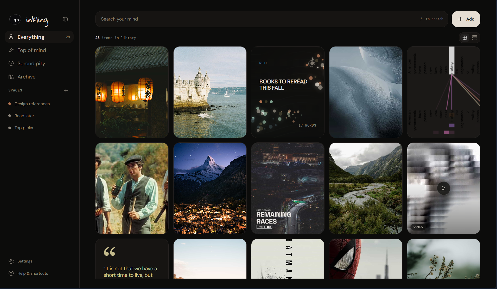
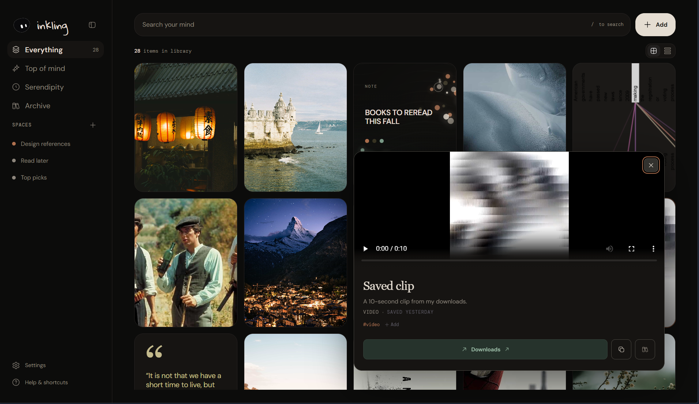

# inkling

### Save anything cool or worth remembering. Find it later without organizing.

inkling is a quiet little home for everything you want to keep: articles, images, screenshots, PDFs, notes, quotes, and video links. No folders to maintain, no manually tagging documents. You save something in a couple of seconds; inkling helps you find it again later.

Everything lives on your own computer. Nothing leaves ever leaves.

<!-- Mascots live here once they're ready: docs/assets/mascots/mascot-1.png, mascot-2.png, ... -->



## Why you'll like it

**You don't have to micromanage it.** Like actaully. Just save things and let it do its shit. The search is the organizer. inkling indexes what you saved in the background so you can find it later by describing it.

**It's visual.** Your library's displayed as a beautiful grid, not some ugly list of item details or some random, hastily made, scrapbook looking ideaboard. Articles, photos, PDFs, quotes, notes, videos, and posts each either show their contents in full or have their own custom little thumbnail made.

**It's private.** Your library is stored locally in SQLite on your Windows machine, with your files kept as content-addressed assets beside it. No cloud account required, no feed, no likes, no tracking, but unfortunately no sharing 🥲.


## Take the tour

### 1. Save in seconds

Paste a URL, drag in a file, paste from your clipboard, take a screenshot, or save from your browser with the companion extension(soon). inkling creates the card immediately and does the heavy lifting quietly in the background.



Supported media:

- URLs and articles (with a clean, readable copy extracted automatically)
- Images, screenshots, and PDFs (yes, even scanned ones)
- Quick notes and quotes with source attribution
- YouTube / Vimeo links and local video files
- Posts from X, plus files, clippings, and references

### 2. Find anything, even inside pictures

Search for any word including words *inside* your images and scanned documents. inkling reads text out of pictures (OCR) so a screenshot of a recipe, a photo of a whiteboard, or a scanned PDF is just as searchable as a note you typed.

It also understands meaning, not just exact words, and can find images that look similar to another image. Something like `shoes blue`, `type:image`, `tag:research`, or `red honeycrisp apple` just works.

### 3. Browse, read, and rediscover

- **Visual library** — masonry grid with thumbnails generated automatically.
- **Distraction-free reader** — saved articles open with clean typography and styling, without ads or page clutter.
- **PDF viewer** — page navigation built in.
- **Video cards** — YouTube and Vimeo links get previews with click-to-play; uploaded videos play natively.
- **Quote cards** — save a qoute with where it came from.
- **Smart Spaces** — Bascially saved search queries, Spaces update themselves. Save a search once (say, `tag:essay` or your favorite pieces) and new saves show up on their own.

### 4. Your stuff stays yours

- Local-first: database + assets on your disk, exportable together.
- Background processing: capture is instant; OCR, embeddings, and indexing happen while you look around.
- No social features, no cloud required, no AI-management chores. AI-derived helpers stay invisible. They just make search better.

## See it in action

Short clips say more than paragraphs. (Placeholders for now, real ones soon.)

- *Coming soon:* save a page, then find it by a word inside it.
- *Coming soon:* slow scroll through the visual library + opening the reader.

## Meet the mascots

inkling's mascots aren't quite ready — they're being drawn right now. This is where they'll live:

- `docs/assets/mascots/mascot-1.png`
- `docs/assets/mascots/mascot-2.png`

Once they land, one will greet you at the top of this README and the other will pop up in various areas of the ui and library while also reflecting its state.

## What's next

Little by little, inkling is growing toward:

- Search that understands meaning even better, and "find more like this image"
- Focus Mode for long-form writing and a richer note editor
- Serendipity mode (a slow stroll through older saves) and Top of Mind pins (will be renamed soon because of copyright worries)
- Trash with undo, backups and export, first-run onboarding
- A Windows installer with updates
- Possibly cross platform support in the future if I can get money for a macbook and find some time to test it on linux. Likely distros will be Ubuntu, Arch, and Debain for the widest range of support up-front.

See [the Roadmap](docs/roadmap.md) for the honest, checkbox-level status.

## Status

Early development, but the core already works: capture, storage, keyword search (including OCR text), thumbnails, the reader, video cards, and Smart Spaces. Expect rough edges and missing pieces and please file issues for the ones that bug you. I'm trying to make this into a product that you and I can use day-to-day.


## FAQ

**Do I need to file things into folders?**
Nope. Save it and move on. If you *like* curating, Smart Spaces are there for intentional collections. Manual collections are being considered as a legacy option.

**Is my stuff uploaded somewhere?**
Nope. Processing and storage are local. Network access is only used on first run to fetch the indexing models or after that when fetching a URL or remote media you want to save.

**What can I save?**
Articles, general web pages, images, screenshots, PDFs, notes, quotes, video links, X posts, and miscellaneous files.

**Does it work offline?**
Well no duh. Saving a fresh URL needs internet though, obviously.


## For developers

### Working with the source

**Windows** (that's the only platform for now).

1. Install [Bun](https://bun.sh) 1.4.0 (the version in `.bun-version`) and a Rust toolchain.
2. Clone this repo, then:

```powershell
bun install
bun run tauri dev
```

Just want a quick look at the UI without the long Rust build? Run the web preview instead:

```powershell
bun install
bun run preview
```

Save from your browser too: the companion extension talks to the app through an `inkling://capture?url=...` deep link.

This part is for people who want to build, tinker, or contribute. Everyone else can stop here. 🙂

**Stack:** Tauri 2 + React + TypeScript + Vite on the front, Rust + SQLite (FTS5) in the back. Article extraction with Defuddle, OCR with Windows OCR + Tesseract, local Nomic text/vision embeddings through ONNX Runtime. Full reasoning in the [tech stack](docs/tech-stack.md).

**Start here:**

- [Docs index](docs/README.md) — full map of product, architecture, and operations docs
- [Contributing](CONTRIBUTING.md) and [development guide](docs/operations/development.md) — setup, commands, checks, troubleshooting
- [docs/product.md](docs/product.md) — who it's for and why it exists
- [docs/product-behavior.md](docs/product-behavior.md) — how each feature should behave
- [docs/tech-stack.md](docs/tech-stack.md) — architecture choices and reasoning
- [docs/roadmap.md](docs/roadmap.md) — where things stand
- [docs/changelog.md](docs/changelog.md) — what changed recently
- `benchmarks/` — 48-item corpus + harness for extraction/OCR quality

**Prereqs:** Bun 1.4.0 (see `.bun-version`) + Rust. 

On Windows pick one toolchain per machine:

- MSVC: Recommended with admin rights, via Visual Studio Build Tools + `rustup default stable-x86_64-pc-windows-msvc`
or
- GNU: No admin needed: `scoop install gcc`, then `rustup toolchain install stable-x86_64-pc-windows-gnu` + `rustup override set stable-x86_64-pc-windows-gnu` in the checkout.

**Commands:**

```powershell
bun install
bun run preview      # quick web preview of the UI
bun run tauri dev    # full Windows desktop app
bun run check:frontend  # same checks CI runs before pushing frontend changes
```

License: MIT
